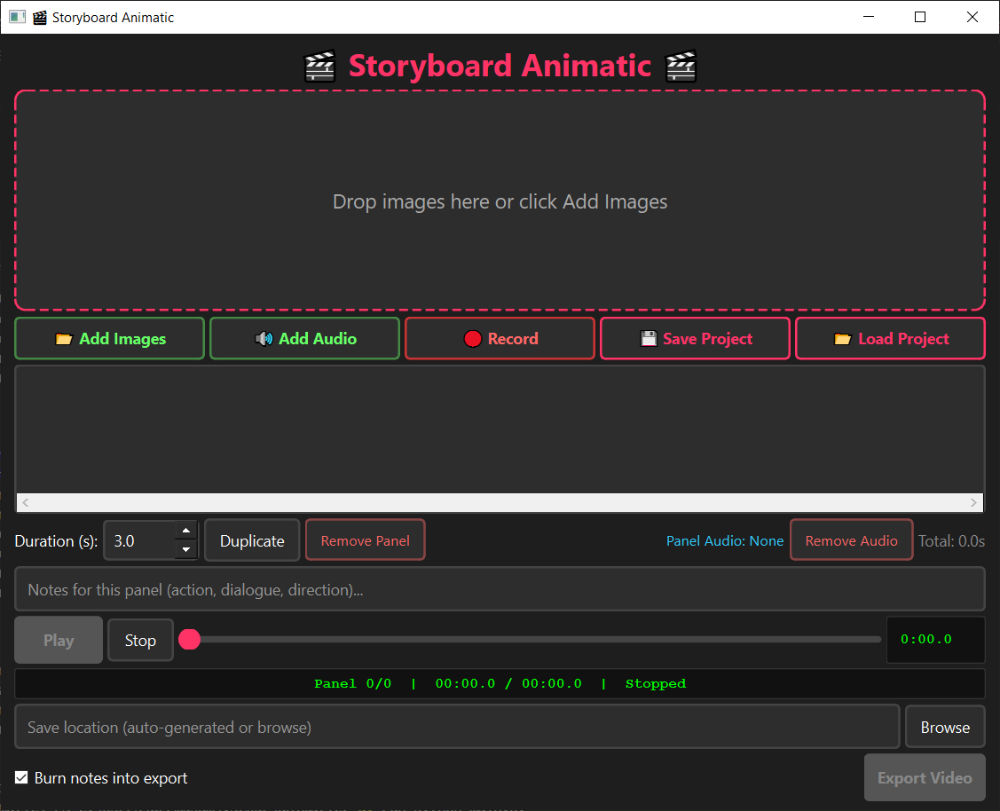
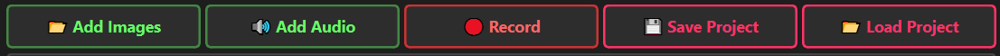
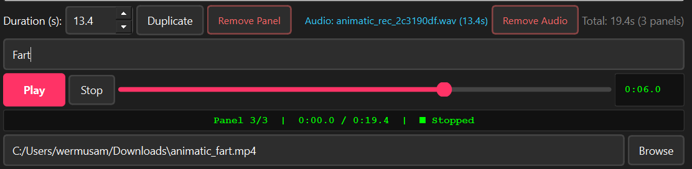
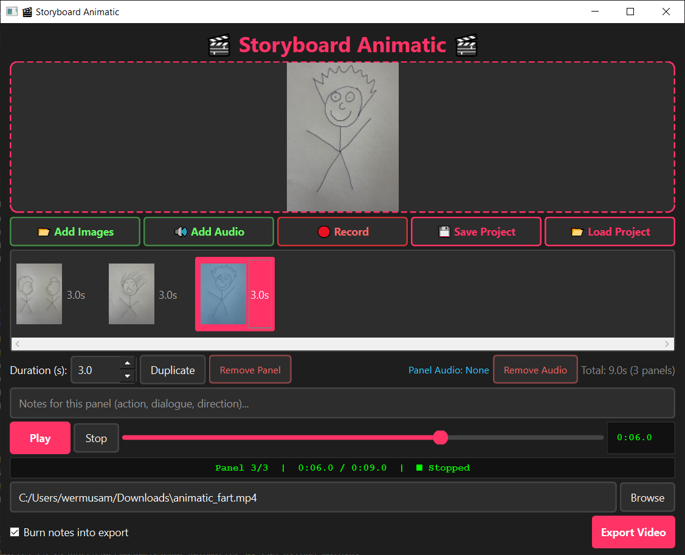
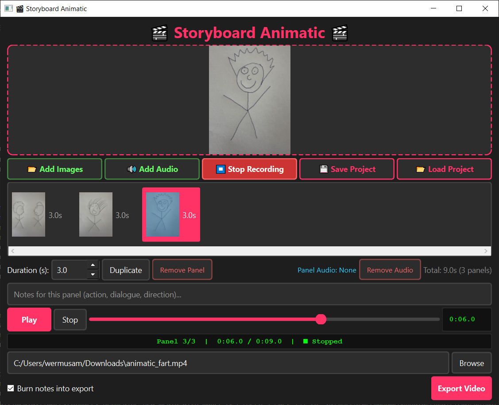
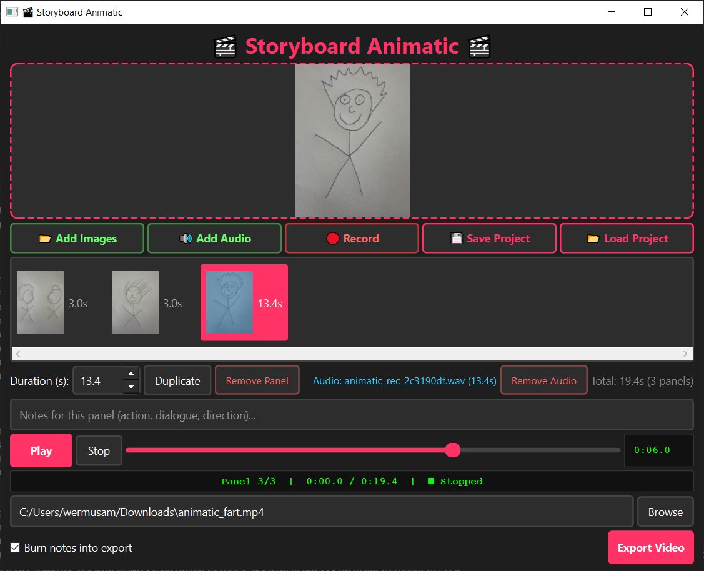
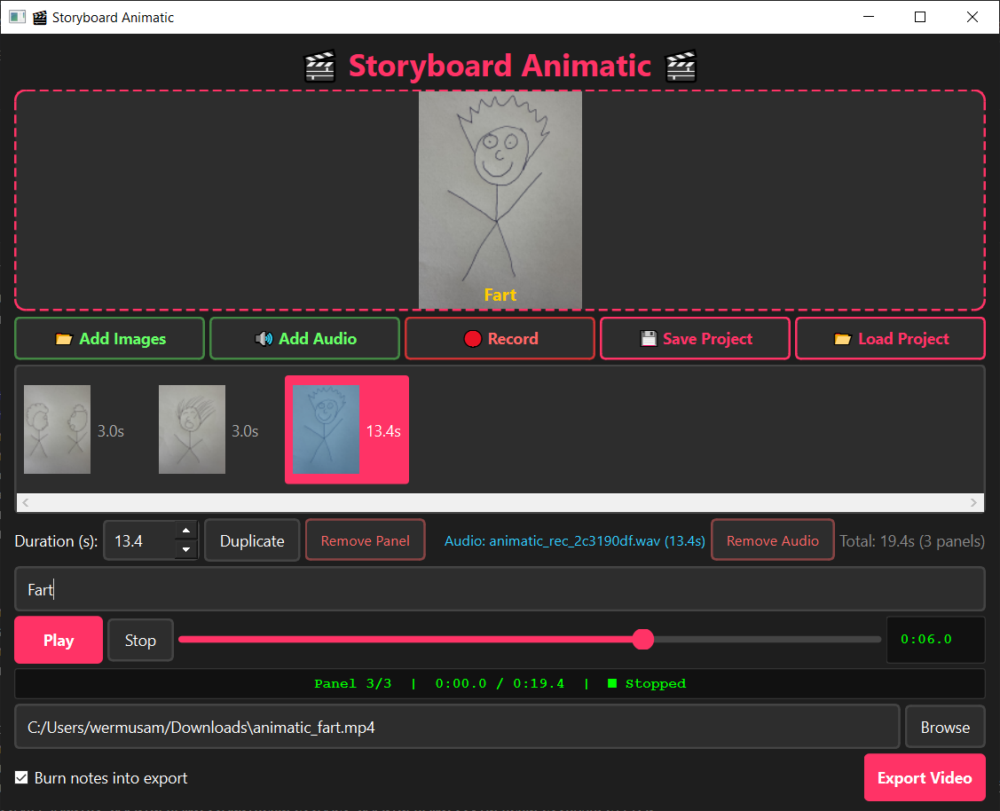
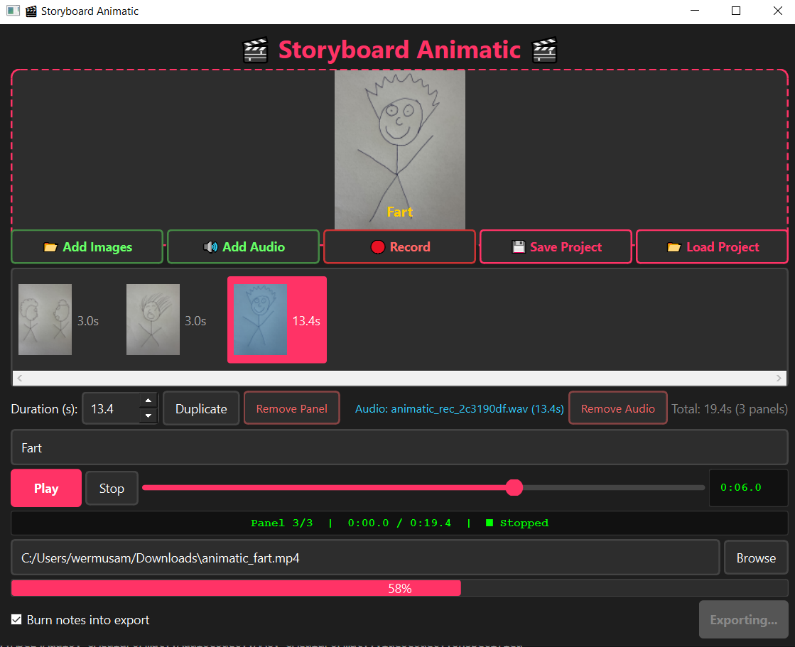
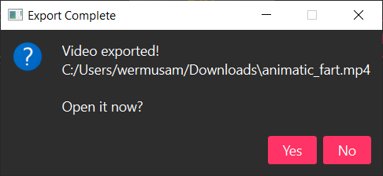

# Storyboard Animatic

A free, offline storyboard animatic tool. Drag in images, add voice lines, preview, and export an MP4 to share with your team.

No subscriptions, no cloud, no account. Works on Windows, Mac, and Linux.



## Download

Click the link for your computer to download:

* **[Download for Windows](https://github.com/wermusam/animatic/releases/latest/download/StoryboardAnimatic-Windows.exe)**
* **[Download for Mac](https://github.com/wermusam/animatic/releases/latest/download/StoryboardAnimatic-Mac)**
* **[Download for Linux](https://github.com/wermusam/animatic/releases/latest/download/StoryboardAnimatic-Linux)**

No installation. Download and run.

**Mac users:** On first run, Mac may block the file because it's not signed. Right click the file, then Open, then Open anyway.

**Windows users:** Windows SmartScreen may warn that the publisher is unknown. Click "More info," then "Run anyway."

## What's an animatic?

An animatic is a moving storyboard. You take still drawings, set how long each one is on screen, add voice lines, and stitch them into a video. Directors use this to test pacing and dialogue before any real animation happens.

## The window

When you open the app, you'll see this:


From top to bottom:

* The title bar
* The preview area (where the dotted box says "Drop images here or click Add Images")
* The button row:

  

  * **Add Images** (green): opens a file picker for images
  * **Add Audio** (green): opens a file picker for audio
  * **Record** (red): records from your microphone
  * **Save Project** (pink): saves a `.animatic` file
  * **Load Project** (pink): opens a `.animatic` file

* The panel strip (empty until you add images)
* The controls row:

  

  * **Duration** spinner: seconds for the selected panel
  * **Duplicate** / **Remove Panel** buttons act on the selected panel
  * **Audio** label shows the audio filename and duration if any is attached
  * **Remove Audio** clears audio from the selected panel
  * **Total** shows the total length of the animatic and panel count
  * **Notes** field is free text per panel
  * **Play / Stop** plus the scrub bar and timecode for previewing
  * **Save location** plus **Browse** sets where the MP4 will be written
  * **Burn notes into export** checkbox plus **Export Video** button

## How to make an animatic (step by step)

### 1. Add your storyboard images

You have three options:

**Option A: drag and drop.**
Open your file browser, find your images (.png, .jpg, .jpeg, or .gif), select them all, and drag them onto the app window. They'll appear in the panel strip at the bottom in the order you dragged them.

**Option B: click "Add Images".**
Click the green **Add Images** button. A file picker opens. Select one or more images and click Open.

**Option C: drag a whole folder.**
Drag a folder onto the window. The app pulls in every image inside it.

Each image becomes a "panel" with a default duration of 3 seconds.



### 2. Reorder panels

Click and hold any panel in the strip at the bottom, then drag it left or right. Drop it where you want. The strip refreshes immediately.

### 3. Adjust duration

Click a panel to select it. In the controls row you'll see a **Duration** field (in seconds). Type the number you want (e.g. `1.5` for one and a half seconds) or use the up/down arrows. Press Tab or click somewhere else to commit the change.

If you've added audio to a panel, the duration automatically adjusts to match the audio length, so you don't need to set it manually.

### 4. Add voice lines (audio)

Three ways:

**Option A: record directly in the app.**
1. Click a panel to select it
2. Click the red **Record** button
3. Speak into your mic
4. Click **Stop Recording** (same button, now red and labeled differently)
5. The audio attaches to the selected panel automatically

If you don't like the take, just click Record again. The new recording replaces the old one; no need to delete first.



After you click Stop Recording, the panel duration updates to match the recording length:



**Option B: drag an audio file.**
Drag a .mp3, .wav, or .m4a file onto a panel in the strip (or onto the main window after selecting a panel). It attaches to that panel.

**Option C: click "Add Audio".**
Select a panel, click **Add Audio**, pick a file. Same result.

To remove audio from a panel: select the panel, click the **Remove Audio** button.

### 5. Add notes

Click a panel to select it. Type into the **Notes** field. Notes are for things like:
* What the character is saying ("LINA: I'm not going back.")
* Direction for the team ("closeup on her hand")
* Anything else you want the voice actor or animator to know

Notes are saved with the project and can be optionally burned into the exported video. While typing, you'll see them appear as yellow text near the bottom of the preview:



### 6. Preview

Click **Play** (or press Space). The app flips through your panels in order, plays the audio, and shows a yellow caption with the notes for each panel.

You can:
* **Pause** with the Pause button (or press Space again)
* **Stop** with the Stop button (resets to the start)
* **Scrub** by clicking anywhere on the timeline bar
* **Step through panels** with the left/right arrow keys

### 7. Export to MP4

1. Click the pink **Export Video** button
2. A save dialog opens. Pick a folder and filename (the `.mp4` extension is added automatically if you forget)
3. If "Burn notes into export" is checked, your notes will appear as yellow subtitles at the bottom of the video
4. A progress bar shows how far along the export is
5. When it's done, the app asks if you want to open the video. Click Yes to play it in your system's video player





The exported MP4 plays anywhere: Discord, Quicktime, VLC, web browsers, phones.

### 8. Save your project

Click **Save Project**. Pick a location and name. The file ends in `.animatic` (it's just JSON, text you can read).

To open a saved project later: click **Load Project** and pick the file. Or drag the `.animatic` file onto the app window.

Your audio and image files are referenced by their original location. If you move them, the project won't find them. Keep them in the same folder for safety.

## Keyboard shortcuts

| Key | Does what |
|---|---|
| Space | Play / Pause |
| Left arrow | Previous panel |
| Right arrow | Next panel |
| Delete | Remove selected panel |
| Ctrl+D | Duplicate selected panel |
| Ctrl+Z | Undo |
| Ctrl+Y | Redo |
| Ctrl+S | Save project |
| Ctrl+O | Open project |

While typing in the Notes field or Duration field, these shortcuts are disabled so you can type spaces and delete characters normally.

## Tips

* **Phone photos look rotated wrong?** The app handles EXIF rotation automatically. What you see in preview is what you get in the export.
* **Audio quiet in the export?** The app normalizes each panel's audio so quiet recordings get boosted. If it's still quiet, your mic input level was very low; record again closer to the mic.
* **Want a clean export with no text?** Uncheck "Burn notes into export" before clicking Export Video.
* **Crashed during export?** Your project file is safe (it was already saved before you hit export). Just reopen and try again.
* **Want to test pacing without exporting?** The preview is accurate. Use it to nail timing, then export once you're happy.

## Troubleshooting

**"Add Images doesn't accept my file"**
Only .png, .jpg, .jpeg, and .gif work. Convert other formats first.

**"Record button does nothing"**
Your OS needs to grant microphone permission to the app. On Mac, check System Settings, Privacy & Security, Microphone. On Windows, check Settings, Privacy, Microphone.

**"Export takes forever"**
First export of a session is slower because images get processed for rotation. After that, the processed images are cached and repeat exports are fast. Big images (>4K) will be slower than small ones (1920x1080 is the target resolution).

**"The MP4 won't play on my friend's machine"**
The export uses H.264 video and AAC audio, which play everywhere. If it really doesn't play, check the file actually finished exporting (the progress bar should hit 100%).

## For developers

### Run from source

You need [uv](https://docs.astral.sh/uv/) (a Python package manager):

**Mac/Linux:**
```
curl -LsSf https://astral.sh/uv/install.sh | sh
```

**Windows (PowerShell):**
```
powershell -ExecutionPolicy ByPass -c "irm https://astral.sh/uv/install.ps1 | iex"
```

Clone and run:
```
git clone https://github.com/wermusam/animatic.git
cd animatic
uv sync
uv run python main.py
```

`uv` installs Python 3.13, PySide6, and FFmpeg automatically.

### Run tests

```
uv run pytest tests/
```

On Linux without a display:
```
QT_QPA_PLATFORM=offscreen uv run pytest tests/
```

137 tests covering panel management, audio handling, export commands, undo/redo, and UI interactions.

### Lint and format

```
uv run ruff check src/ tests/
uv run ruff format src/ tests/
```

### Project layout

```
animatic/
├── main.py                      # entry point
├── src/animatic/
│   ├── main_window.py           # the GUI (most code lives here)
│   ├── engine.py                # FFmpeg command construction
│   ├── player.py                # preview playback
│   └── models.py                # Panel and Project data classes
├── tests/                       # pytest suite
└── pyproject.toml
```

### Tech stack

* **PySide6**: Qt for Python (the GUI framework)
* **FFmpeg**: video encoding, bundled via `imageio-ffmpeg` (no system install needed)
* **uv**: dependency management and Python version pinning

## License

Free to use, modify, and share. No warranty.
